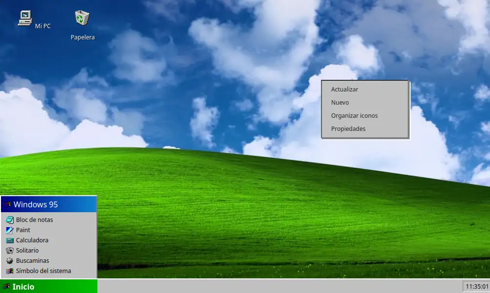

# Windows 97/Vista Web Simulator

Este proyecto es un simulador visual de un sistema operativo inspirado en Windows 97 y Windows Vista, hecho en HTML, CSS y JavaScript. Incluye:

- Escritorio con iconos y menú contextual
- Menú inicio clásico
- Explorador de archivos navegable (futura actualización)
- Reloj y calendario estilo retro
- Ventanas y apps clásicas (calculadora, bloc de notas, etc.) (pendientes algunas)
- Iconos locales 